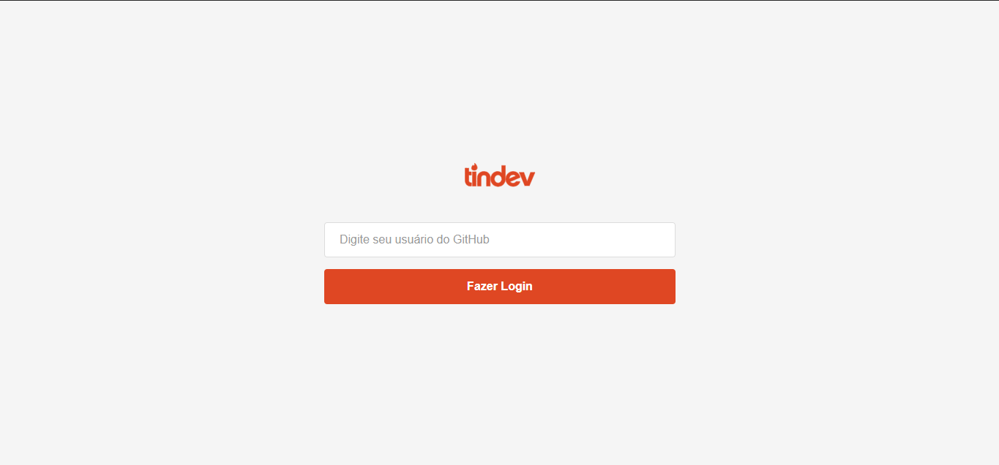
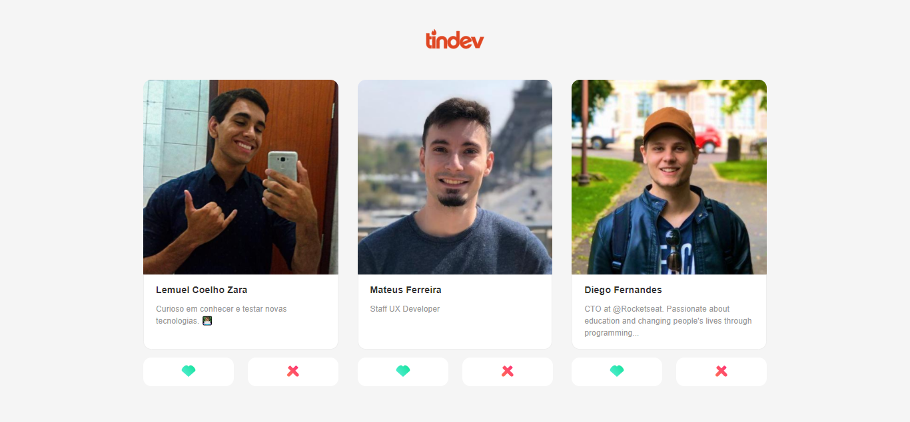

<p align="center">
  
</p>

<div align="center">
  
  
  
  
  
  

</div>

<br>

---
## 📋 Índice

- [O que é o projeto?](#-Sobre)
- [Preview](#-Preview)
- [Quais tecnologias foram utilizadas?](#-Tecnologias-utilizadas)
- [Como executar o projeto?](#-Como-executar-o-projeto)

<br>

---
## 🖥 Preview 

<p align="center">
  
  
  
</p>

<br>

---
## 📖 Sobre 

O Tindev é um clone da aplicação do Tinder, só que feita para desenvolvedores.

<br>

---
## 🚀 Tecnologias utilizadas

O projeto está desenvolvido utilizando as seguintes tecnologias:

- [Node.js](https://nodejs.org/en/)
- [React.js](https://pt-br.reactjs.org/)
- [React Native](https://reactnative.dev/)
- [MongoDB](https://www.mongodb.com/)
- [Docker](https://www.docker.com/)

<br>

---
## ⌨ Como executar o projeto

Antes de tudo, faça o clone do repositório:

```bash
# Clonando o repositório
git clone https://github.com/lemuelZara/tindev.git
```

### ✅ Executando o backend do Tindev


```bash
# Entre no diretório
cd backend

# Crie um arquivo de variáveis de ambiente e coloque seus respectivos valores
touch .env

# Baixe as dependências
yarn

# Inicie o container do MongoDB
docker-compose up -d

# Inicie o servidor
yarn dev
```

> Observação: para conseguir roda o backend, é necessário ter o Docker instalado na sua máquina!

<br>


### ✅ Executando o frontend do Tindev

```bash
# Entre no diretório
cd frontend

# Baixe as dependências
yarn

# Inicie a parte web
yarn start
```

<br>


### ✅ Executando o mobile do Tindev

```bash
# Entrar no diretório
cd mobile

# Baixar as dependências
yarn

# Inicie a parte mobile
yarn start

# Execute o projeto no seu smartphone
yarn android
```

<br>

---
Desenvolvido com 💜 por Lemuel Coelho Zara